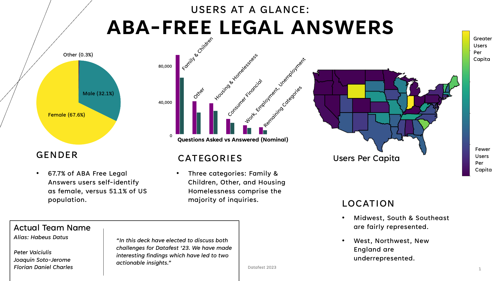
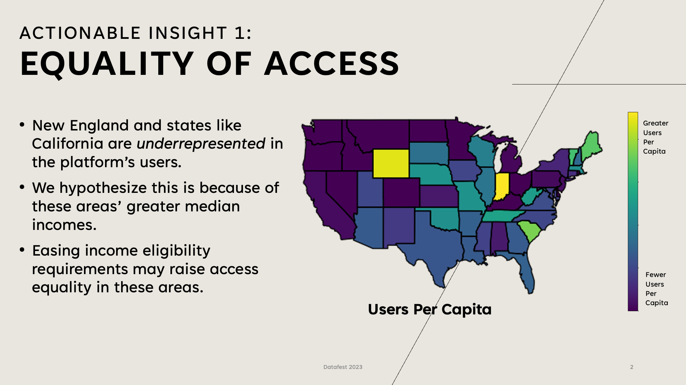
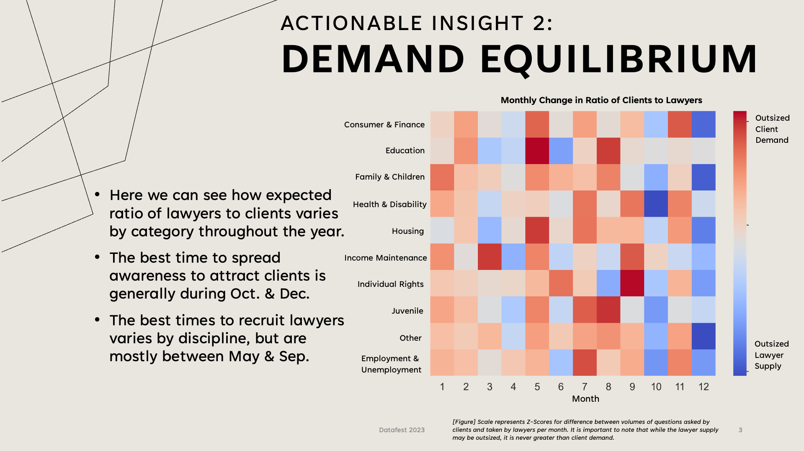

# Datafest 23'
Datafest is a data-focused hackathon organized by the [American Statistical Society (ASA)](https://ww2.amstat.org/education/datafest/datafestinabox.cfm).
In it, teams are given a dataset and a problem to solve. The teams have limited time to analyze the data and compile
a presentation to be studied and judged.

This year, the dataset came from the American Bar Association's organization for [free legal answers](https://ny.freelegalanswers.org/)
, a program to provide free legal advice to people who cannot afford a lawyer. The dataset contains information about 
the users, the questions they asked, and the answers they received. The problem centered around better understanding
their userbase and its needs, and coming up with ways to improve the platform's effectiveness.

# Our Analysis

## Introduction - User Demographics
In analyzing the user demographics, we came across a couple interesting findings, which we considered to be statistics
you would not expect beforehand. These three statistics are:
* Gender
* Question Categories
* User Geography

### Gender
Women are overrepresented, with over 2/3 of users self-identified as female, versus about 50% of the general population.
### Categories
The most common category by quite a wide margin is family law, with over 1/3 of all questions being in this category.
This might explain the high number of female users.
### Geography
Studying the geographic distribution of users, we found that the most of New England, and the Pacific Northwest are
underrepresented, while the South and Midwest are represented proportionally, and two outliers, Wyoming and Indiana were
highly overrepresented.

## Equality of Access
In this section, we looked closer at the geographic distribution of our users, and found that there are some areas
where access to legal advice is not equal. Our analysis concluded that one of the primary reasons for this desparity
is the financial qualification rules for the program. The program is only available to people who make less than some
amount of money, and the amount of money varies by state. In states like California and Washington, the income limit
is disproportionately low compared to the median income in the state, while in states like Wyoming and Indiana, the
income limit is disproportionately high compared to the median income in the state.

Therefore, to improve access to legal advice, we recommend that the program adjust its income limits to be more
proportional to the median income in each state. This would allow the program to reach more people in states with 
higher median incomes.

## Supply and Demand Equilibrium
In this section, we looked at the supply and demand of legal advice. We came to the assumption that the ratio of 'questions
asked to answers given' is a good indicator of the supply and demand of legal advice. We found that the ratio is not 
fixed, and varies quite a lot through the year, and differently across categories. For example, we can see the two most
in demand periods for legal advice pertaining to income maintenance fall in March and September, each month coinciding with
tax filing deadline and the extended tax filing deadline, which makes sense.

From this chart, we can infer the best times to recruit new volunteers to answer questions, and the best times to recruit
more users to ask questions. For example, lawyers seem to be much more available to volunteer during October and December
in general, which implies these might generally be the best times to recruit new volunteers to the program.

